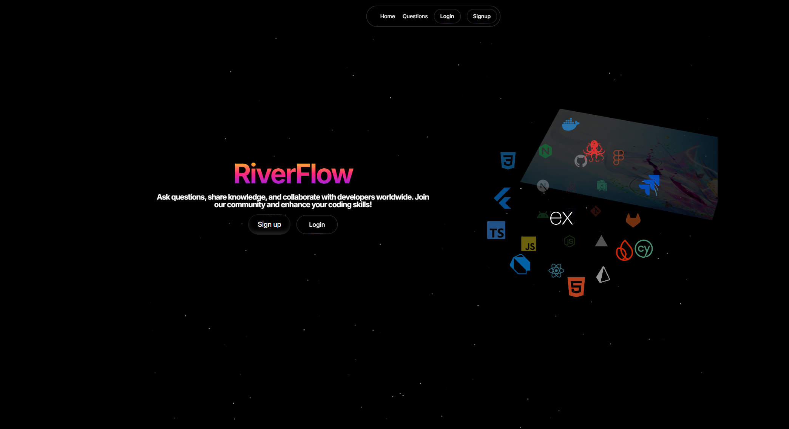

# RiverFlow — A Stack Overflow–Inspired Q&A Platform

RiverFlow is a full-stack question-and-answer platform inspired by Stack Overflow, built with Next.js 14 and Appwrite. It lets users register, ask questions, post answers, vote on content, comment, and search across the platform — with a markdown-first editor and a clean, themeable UI.

## Overview

The goal of RiverFlow was to build a production-style Q&A community app end to end: authentication, a relational-style data model on top of Appwrite's document database, role-based actions (author-only edit/delete), voting and reputation-style aggregation, and a responsive UI with light/dark themes. It's built as a single Next.js app using the App Router, with both the frontend and lightweight backend API routes (answers, comments, votes) living in the same codebase.

## Features

- **Authentication** — Email/password signup and login via Appwrite Auth, with session persisted through a global auth store
- **Questions** — Ask, edit, and delete questions with a markdown editor and file/image attachments
- **Answers** — Post markdown-formatted answers to any question
- **Voting** — Upvote/downvote questions and answers
- **Comments** — Threaded comments on questions and answers
- **User profiles** — Public profile pages per user showing their questions, answers, and votes
- **Search** — Search across questions
- **Markdown support** — Rich text editing via a markdown editor throughout questions, answers, and comments
- **Light/dark themes**
- **Top contributors** — Homepage section highlighting active users

## Tech Stack

| Layer | Technology |
|---|---|
| Framework | Next.js 14 (App Router) |
| Language | TypeScript |
| UI | React 18, Tailwind CSS, shadcn/ui-style components, MagicUI |
| Animation | Framer Motion |
| State management | Zustand |
| Markdown editor | @uiw/react-md-editor |
| Backend / Database | Appwrite (Auth, Database, Storage) |
| Server SDK | node-appwrite |
| Client SDK | appwrite |
| Icons | Tabler Icons, Lucide React |
| Deployment | Vercel |

## Architecture

- **Client SDK** (`appwrite`) handles authentication and session state directly from the browser, backed by a Zustand store (`src/store/Auth.ts`) for global auth state.
- **Server SDK** (`node-appwrite`) powers API routes under `src/app/api/` (`answer`, `comment`, `vote`) for server-side writes that need elevated permissions.
- **Database schema** is defined in code under `src/models/server/` — separate collection definitions for questions, answers, comments, and votes, plus a `dbSetup.ts` script that provisions the Appwrite database and collections, and `storageSetup.ts` for the attachment bucket.
- **Routing** follows Next.js App Router conventions: an `(auth)` route group for login/register, dynamic routes for individual questions (`questions/[quesId]/[quesName]`) and user profiles (`users/[userId]/[userSlug]`) with nested tabs for a user's questions, answers, and votes.

## Project Structure

```
src/
  app/
    (auth)/            # Login & register routes
    api/                # Server routes: answer, comment, vote
    components/         # Header, Footer, HeroSection, LatestQuestions, TopContributers
    questions/           # Question list, ask, view, edit, search
    users/[userId]/      # Public profile: questions, answers, votes, edit
  components/
    ui/                  # Reusable UI primitives
    magicui/             # MagicUI components
  models/
    client/              # Appwrite client config
    server/               # Collection schemas + DB/storage setup scripts
  store/                 # Zustand auth store
  lib/                   # Utilities
```

## Getting Started

### Prerequisites

- [Node.js](https://nodejs.org/en/download/) (v16.14.0 or higher)
- An [Appwrite](https://appwrite.io/docs/installation) project (self-hosted or Appwrite Cloud)

### Installation

```bash
git clone https://github.com/dipam-2123/stackoverflow.git
cd stackoverflow
npm install
```

### Environment Variables

Create a `.env.local` file with your Appwrite project details:

```
NEXT_PUBLIC_APPWRITE_HOST_URL=
NEXT_PUBLIC_APPWRITE_PROJECT_ID=
NEXT_PUBLIC_APPWRITE_DATABASE_ID=
NEXT_PUBLIC_APPWRITE_QUESTION_COLLECTION_ID=
NEXT_PUBLIC_APPWRITE_ANSWER_COLLECTION_ID=
NEXT_PUBLIC_APPWRITE_COMMENT_COLLECTION_ID=
NEXT_PUBLIC_APPWRITE_VOTE_COLLECTION_ID=
NEXT_PUBLIC_APPWRITE_QUESTION_ATTACHMENT_BUCKET_ID=
APPWRITE_API_KEY=
```

### Run the project

```bash
npm run dev
```

The app will be available at `http://localhost:3000`. On first run, the app provisions the required Appwrite database, collections, and storage bucket automatically via the setup scripts.

## Screenshots

### Home


Landing page with the app hero, a one-line pitch, and a direct "Ask a question" call-to-action. The top nav (Home, Questions, Profile, Logout) is available site-wide once a user is authenticated.

### Questions list


The `/questions` route — every question in the platform, each showing vote count, answer count, tags, author, and how long ago it was asked. Includes a search bar to filter questions and pagination for larger result sets. This is the main entry point for browsing the community's content.

### Ask a question


The question submission form: a title field, a full markdown editor (bold, headings, links, quotes, code blocks, images, lists, tables) for the question body, an optional image attachment upload, and a tag input with suggestions. Submitting writes a new document to the questions collection in Appwrite.

### User profile


A public profile page for each user (`/users/[userId]/[userSlug]`), showing their display name, join date, and last activity, with tabs to drill into their Reputation, Questions asked, and Answers given. This is the same view every user gets when visiting their own or another member's profile.

*(Login/register and question-detail pages follow the same structure — add screenshots for those the same way if you'd like fuller coverage.)*

## Build More Features on Top of This

You can extend this by adding more collections and indexes to the database, or new routes to handle more functionality. The codebase is organized so the schema, API routes, and UI are cleanly separated, making it straightforward to build on.

## Author

**Dipam Kr Baruah**
B.Tech, Electronics & Telecommunication Engineering
GitHub: [github.com/dipam-2123](https://github.com/dipam-2123)

## License

This project is intended for educational and portfolio purposes.
